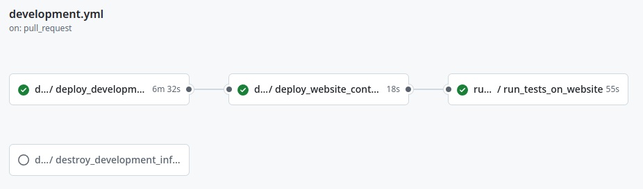
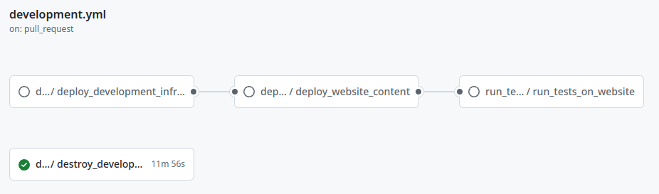

import { Image } from "astro:assets";

### Introduction
For a long time, I've wanted to carve out a space for myself on the internet. I've made a few attempts before, but dropped them mostly because of a loss of interest. This time, I was inspired by the [Cloud Resume Challenge](https://cloudresumechallenge.dev/) to not only create the website, but to learn new things like infrastructure as code and build automation. As it turned out, having these new things to learn was what kept me motivated and eager to continue working on this project.

### Frontend

I chose [Astro](https://astro.build/) to build this website because it was very convenient to install and setup using npm. Since I didn't have issues creating the website and had no performance issues, I didn't have any reason to switch to another framework.

- [Amazon CloudFront](https://aws.amazon.com/cloudfront/) for distributing content
- [Amazon S3](https://aws.amazon.com/s3/) for storing content
- [Cloudflare](https://www.cloudflare.com/) for custom domain and routing (production environment only)

Frontend code can be found here: https://github.com/huynhlkevin/personal-website

### Backend

The only dynamic part of the website is the visitor counter, updated every time a new user visits the website.

- [Amazon API Gateway](https://aws.amazon.com/api-gateway/) for triggering the Lambda function
- [Amazon Lambda](https://aws.amazon.com/lambda/) for reading and editing the visitor count
- [Amazon DynamoDB](https://aws.amazon.com/dynamodb/) for storing the visitor count

The REST API and Lambda code can be found here: https://github.com/huynhlkevin/personal-website-infrastructure/tree/main/resources

### Infrastructure as Code && Build Automation

The combination of infrastructure as code and build automation robbed me of my afternoons and nights. While these components made no difference to the user experience of the website, they improved the development experience through massive time savings and consistent deployments.

#### Automation

1. Developer does something (e.g. opens pull request) on [GitHub](https://github.com/), triggering GitHub Actions.
1. GitHub Actions sends [Terraform](https://www.terraform.io/) commands to [HCP Terraform](https://app.terraform.io/).
1. HCP Terraform creates, updates, or destroys resources on AWS. It also stores the infrastructure state.

#### GitHub Workflow

Note:
- Each pull request deploys its own development environment
- I was following trunk based development, so there was only one branch to merge pull requests into

When I open a pull request or update code on a pull request:

1. Deploy development infrastructure
1. Deploy website content to development environment
1. Run tests on development website

When I merge a pull request:

1. Destroy development infrastructure

1. Deploy production infrastructure
1. Deploy website content to production environment
1. Run tests on production website

Infrastructure code can be found here:

https://github.com/huynhlkevin/personal-website-infrastructure

Workflows can be found here:

https://github.com/huynhlkevin/personal-website/tree/master/.github/workflows
https://github.com/huynhlkevin/personal-website-infrastructure/tree/main/.github/workflows

Note: The production workflow for the frontend repository does not include deployment of production infrastructure. I excluded it to save some time because I don't expect the production infrastructure to be destroyed regularly.

### Final Words

I'm extremely grateful for having found the [Cloud Resume Challenge](https://cloudresumechallenge.dev/) and I enjoyed its style of providing general guidance instead of step-by-step hand-holding. I've learned a lot about infrastructure as code and build automation from this project and will definitely continue to use what I've learned in future projects.

Finally and most importantly, I need to figure out where to move my website before my AWS Free Tier trial ends.